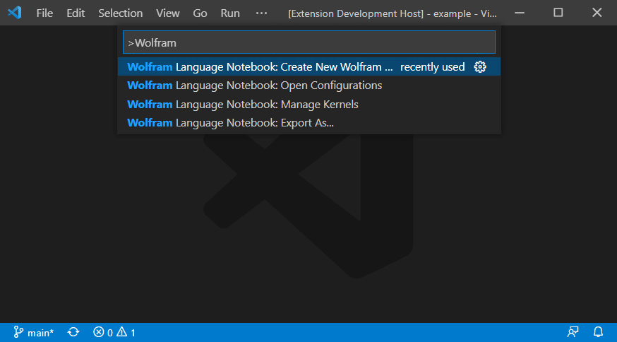

# Notebook support for Wolfram Language in VS Code

## Prerequisites

- `wolframscript`, shipped with [Wolfram Mathematica](https://www.wolfram.com/mathematica/) / [Wolfram Engine](https://www.wolfram.com/engine/) 12.0 or higher;
- OpenSSH (optional), for remote kernel support.

## Getting Started

To create a new Wolfram Language notebook, execute **Create New Wolfram Language Notebook** in the Command Palette, or create a new file with `.wlnb` extension. 

Execute **Manage Kernels** command and choose **Use wolframscript** to add `wolframscript` to the kernel configuration and connect to it. The status of the kernel will be shown in the status bar. 

Add a code cell, type Wolfram language code  in the cell, and evaluate it. 

## Features

**Syntax Highlighting**: The notebook highlights Wolfram language syntax, common built-in functions, and full character names, e.g. `\[Alpha]`.

**Output Renderer**: The notebook renders common Wolfram language expressions into HTML for better presentations. Graphics are shown as rasterized images.

**Export as Wolfram notebook**: The notebooks can be exported as Wolfram notebooks, containing markdown cells, code cells and their outputs.

**Remote kernel**: When configured, the notebook can establish an ssh connection to the remote machine and launch a kernel on it. Computations are done remotely, but code and outputs are stored locally.

## Release Notes

- 0.0.1 The initial release
